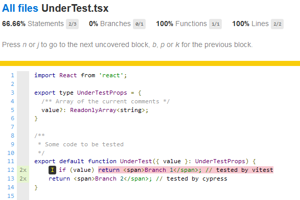
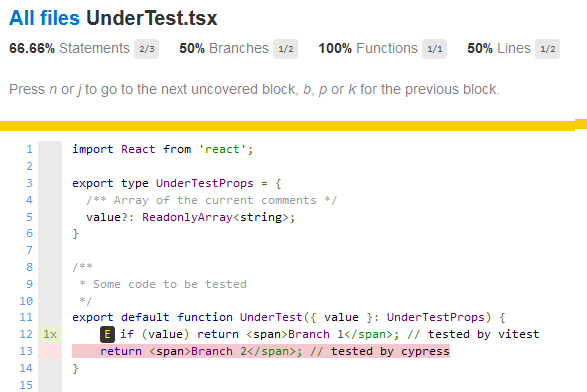
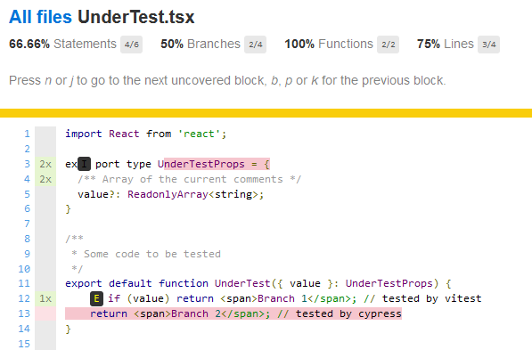

This repo demonstrates differences in coverage reporting between vitest and vite-plugin-istanbul (see https://github.com/vitest-dev/vitest/issues/7109)

## Test procedure
1) Clone the repo and `npm install`
2) Do `npm run cypress` and `npm run report-cypress`. This generates coverage JSON in `.nyc_output/out.json` and LCOV report in `coverage/cypress`.
3) Do `npm run vitest`. This generates coverage JSON and an LCOV report in `coverage/vitest`.
4) Inspecting both LCOV reports, it is easy to verify that both branches of `UnderTest.tsx` are exercised - one by Cypress and one by vitest





5) Inspecting both JSON files, it is slightly less easy to see that the statement maps do not agree with each other on where the statements are.
6) Do `npm run merge-coverage` and `npm run report-merged-coverage`. This generates merged coverage JSON and an LCOV report in `coverage/merged`.

Inspecting the merged LCOV report, the merge has clearly failed:
* we expect both branches of `UnderTest.tsx` to be neatly covered, but the report shows that the cypress branch is not covered
* there is some sort of non-covered statement on line 3, where the input type is declared (so no statement is present)



My hypothesis is that istanbul is configured differently in vitest and vite-istanbul-plugin, making the JSON coverage files non-compatible.

One easy way to see this is in the Cypress JSON coverage file, which includes the following block:

```
"inputSourceMap": {
  "version": 3,
  "sources": [
    "<REDACTED>/src/UnderTest.tsx"
  ],
  "mappings": "AAAA,OAAO,WAAW;AAUlB,wBAAwB,UAAU,EAAE,MAAM,GAAmB;AACzD,MAAI,MAAO,QAAO,oCAAC,cAAK,UAAQ;AAChC,SAAO,oCAAC,cAAK,UAAQ;AACzB;",
  "names": []
}
```

...which is not present in the vitest JSON output. I don't know how the mapping process works but this is clearly not respected during merge.